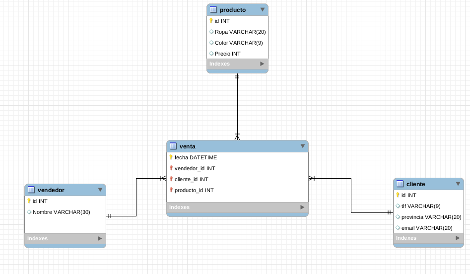

# Proyecto_BD

* Listar información: 1.Listar clientes.

* Contar información: 2.Listar productos.

* Buscar o filtrar información: 3.Buscar productos en un rango de precios.

* Buscar información relacionada: 4.Mostrar los ventas de un trabajador filtrando por nombre.

* Insertar información: 5.Agregar nuevo cliente.

* Borrar información: 6.Eliminar clientes por provincia.

* Actualizar información: 7.Incrementar precio de productos según color.
